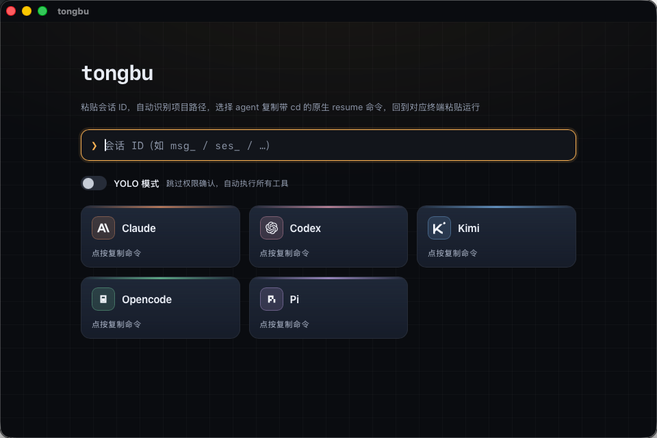
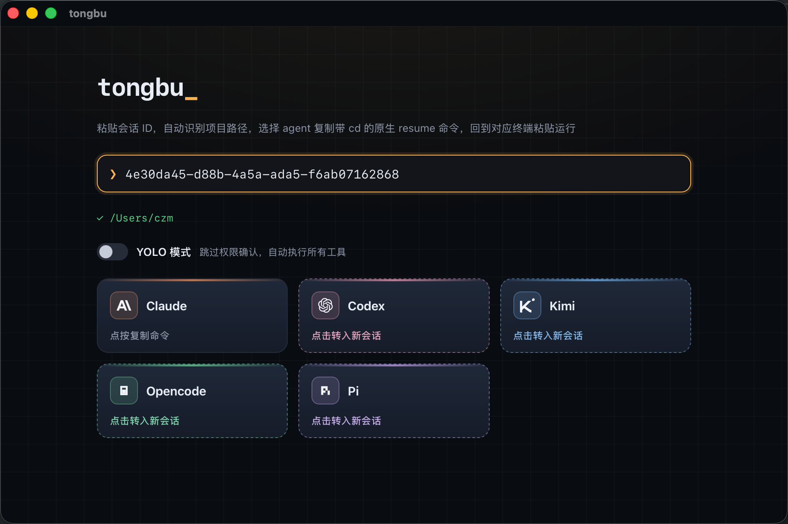
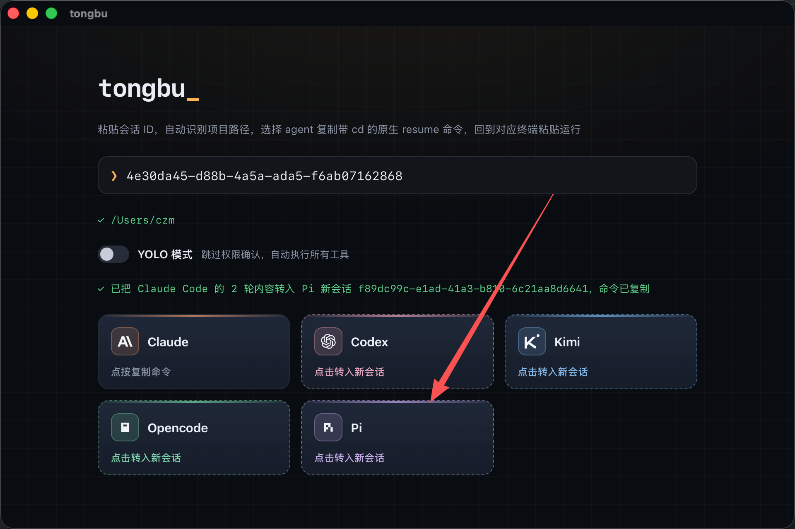
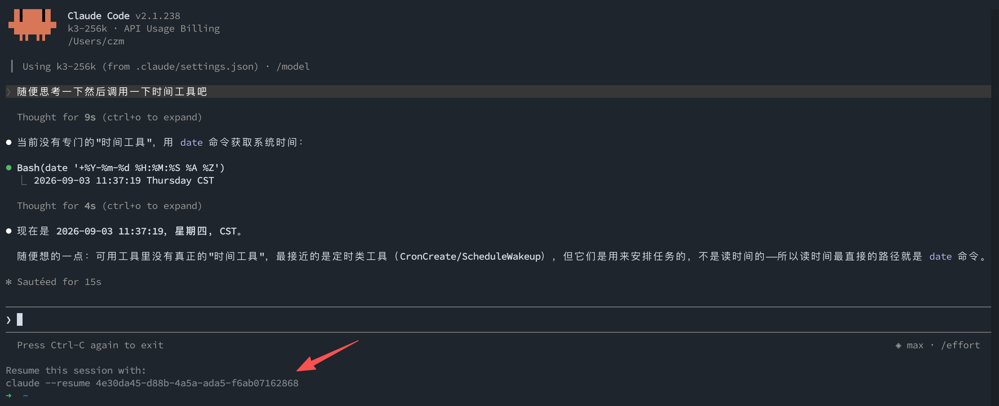
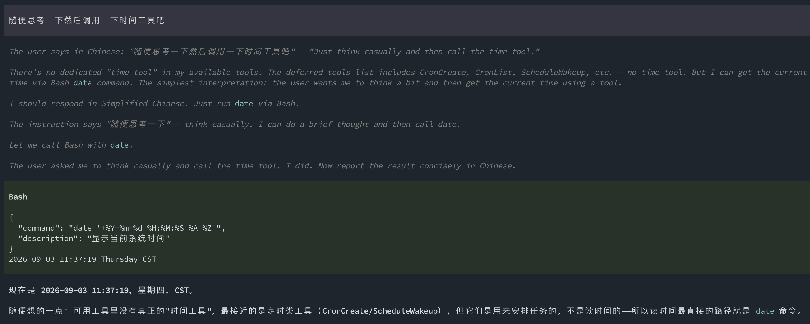
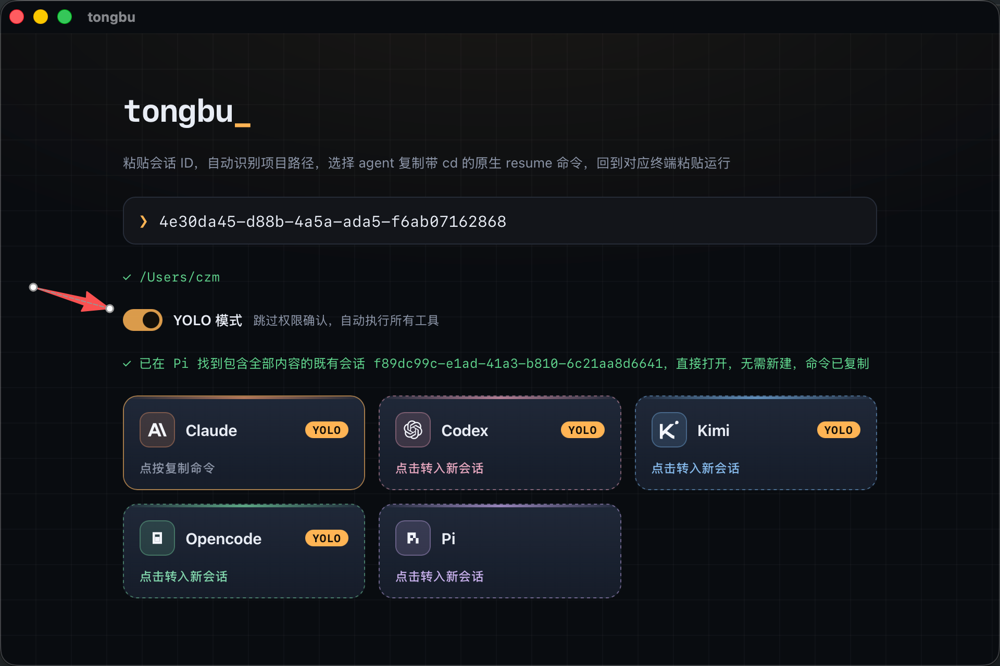

# tongbu

> [中文](README.md)

A small desktop tool for **handing the same job off between CLI coding agents**. Sessions are assets; agents are swappable executors. When one agent stalls, hits its quota, or you just want a different one, carry the session over and keep going.



## Usage

**1. Grab the session ID** — in the agent's terminal, the resume hint printed on exit contains the session ID:



**2. Paste it into tongbu** — it looks up which agent the session belongs to and which project directory it lives in:

**3. Pick a destination** — click the owning agent's card to copy its native resume command (with `cd`); or click another agent's card to import the session content into a fresh session there — the new command is copied automatically:



**4. Paste and run in the terminal** — the new agent picks up with full context. Before and after, the content carries over intact:

Before (Claude Code):



After (Pi):



## YOLO mode

Toggle it on and the copied command includes each agent's no-approval flag (e.g. Claude's `--dangerously-skip-permissions`) — handy for long unattended runs:



## Supported agents

| Agent | resume command | YOLO flag |
|---|---|---|
| Claude Code | `claude --resume <id>` | `--dangerously-skip-permissions` |
| Codex | `codex resume <id>` | `--dangerously-bypass-approvals-and-sandbox` |
| Kimi | `kimi -r <id>` | `--yolo` |
| Opencode | `opencode -s <id>` | `--auto` |
| Pi | `pi --session <id>` | default behavior |

## Install

macOS (.dmg), Windows (.exe), and Linux (.deb) packages are available on the releases page.

Requirements: Node.js installed (used to read the agents' native session data), plus whichever agent CLIs you actually use, installed and signed in.

## Privacy

Everything is **read-only** against each agent's data except "transfer to a new session", which writes into the target agent's session file. Credentials are never read or touched.

## Development

```bash
npm install
npm run desktop:dev             # desktop shell in dev mode
cd desktop && npx tauri build   # build the installer for the current platform
```

- `src/core/` — handoff engine and storage (zero-dep `node:sqlite`, DB at `~/.tongbu/tongbu.db`)
- `src/providers/` — per-agent adapters (read native sessions, write back imports); adding an agent = one new directory + one line in `registry.ts`
- `desktop/` — Tauri thin shell (Vite + React + Rust); only consumes the CLI's `--json` output, never reimplements logic

```bash
npm test               # unit tests
npm run typecheck      # typecheck
```

## Links

- [LINUX DO](https://linux.do) — a friendly tech community
